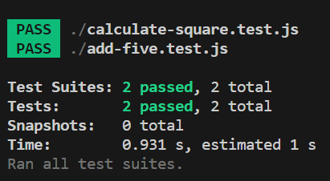

# Learn Node Jest

This is Node js project which includes Unit test cases done using jest

## Getting Started with Learn Node Nest

### Installation (One time process)

- Create a folder with the name `learn-node-jest`
- Open this folder in vs code
- Run `npm init --y` in that folder
- Install jest using `npm install --save-dev jest`

### To Run the application

- Run `npm run test`

### After running the application, output will look as below

